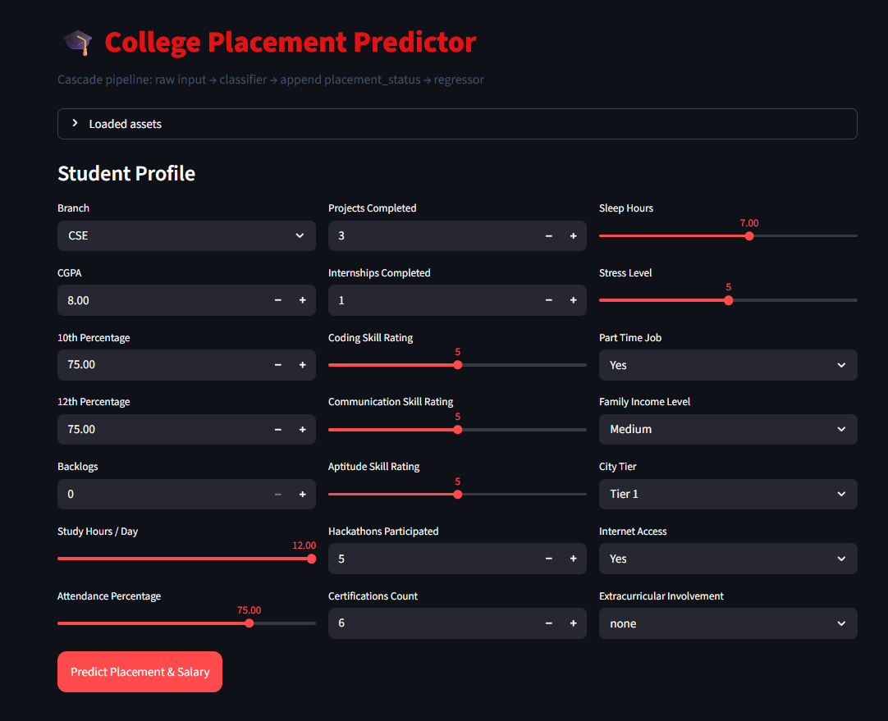
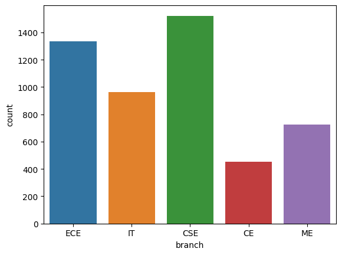
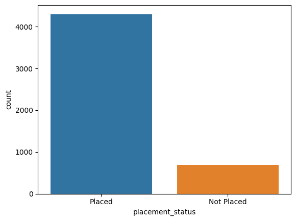
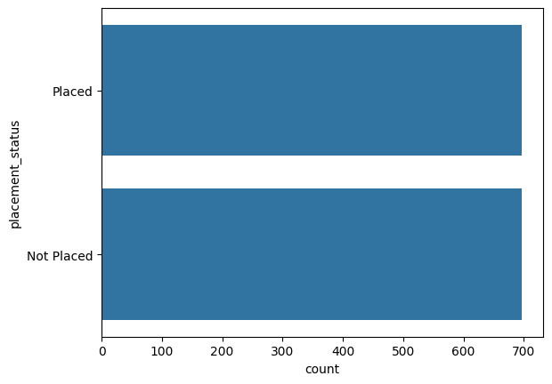
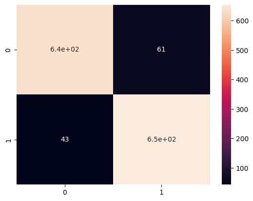
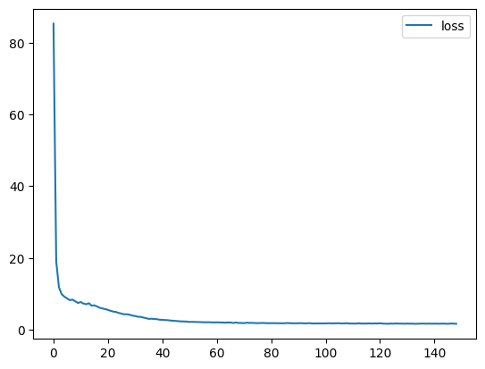
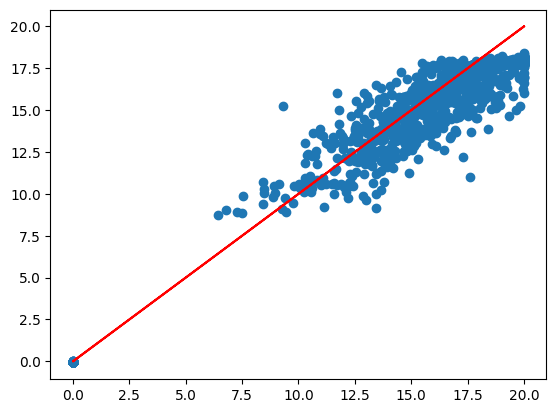

# College Placements Predictor

A machine learning project for predicting student placement outcomes and estimating salary packages using academic, skill-based, and background-related features.

## Overview

This project builds a two-stage placement prediction pipeline:

1. **Placement Classifier** predicts whether a student is likely to be placed.
2. **Salary Regressor** estimates the salary package in LPA for predicted placements.

The project includes:

- Data preprocessing and encoding
- Deep learning classification and regression models
- Exported inference artifacts
- A Streamlit web app for interactive prediction

## Features

- Predicts placement probability
- Predicts estimated salary in LPA
- Uses saved encoder mappings and feature schema for inference consistency
- Includes a Streamlit app for easy interaction
- Contains training notebook, dataset, scalers, and trained Keras models

## Repository Structure

```text
college_placements/
├── app_folder/
│   ├── app.py
│   ├── placement_classifier.keras
│   ├── lpa_regressor.keras
│   ├── classifier_scaler.pkl
│   ├── regressor_scaler.pkl
│   ├── encoder_mappings.json
│   └── feature_columns.json
├── images/
│   ├── interface.png
│   ├── branch_distribution.png
│   ├── initial_placement_distribution.png
│   ├── latter_placement_distribution.png
│   ├── final_conf_matrix.png
│   ├── regressor_loss_plot.png
│   └── regressor_true_pred.png
├── indian_college_placements.ipynb
├── indian_engineering_student_placement.csv
├── placement_targets.csv
├── requirements.txt
├── .gitignore
└── README.md
```

## Screenshots

### Streamlit Interface



### Branch Distribution



### Initial Placement Distribution



### Placement Distribution After Processing



### Final Confusion Matrix



### Regressor Loss Plot



### Regressor True vs Predicted



## Machine Learning Pipeline

### Classification Stage

The classifier predicts whether a student will be placed based on features such as:

- Branch
- CGPA
- 10th and 12th percentages
- Backlogs
- Study hours
- Attendance
- Projects
- Internships
- Coding, communication, and aptitude skill ratings
- Hackathons
- Certifications
- Sleep hours
- Stress level
- Part-time job
- Family income level
- City tier
- Internet access
- Extracurricular involvement

### Regression Stage

The regressor uses the same encoded feature set, along with the predicted `placement_status`, to estimate salary in LPA.

## App Workflow

The Streamlit app follows this inference pipeline:

- Raw user input
- Encoding using saved mappings
- Feature alignment using exported feature columns
- Classification prediction
- Append predicted placement status
- Regression prediction for salary

If placement is predicted as negative, the displayed salary is shown as `0.00 LPA`.

## How to Run

### 1. Clone the repository

```bash
git clone https://github.com/abhishekspawar0803-svg/college_placements.git
cd college_placements
```

### 2. Install dependencies

```bash
pip install -r requirements.txt
```

### 3. Run the Streamlit app

```bash
streamlit run app_folder/app.py
```

## Deployment / Sharing

To share the app temporarily from your machine using Cloudflare Tunnel:

```bash
cloudflared tunnel --url http://localhost:8501
```

## Tech Stack

- Python
- Pandas
- NumPy
- Scikit-learn
- TensorFlow / Keras
- Streamlit
- Joblib
- JSON-based schema and encoder mappings

## Future Improvements

- Improve UI styling and responsiveness
- Add model evaluation summary directly in the app
- Add input validation and better error handling
- Deploy permanently on a cloud platform
- Add model explainability features

## Author

**Abhishek Pawar**

## License

This project is for educational and portfolio purposes.
